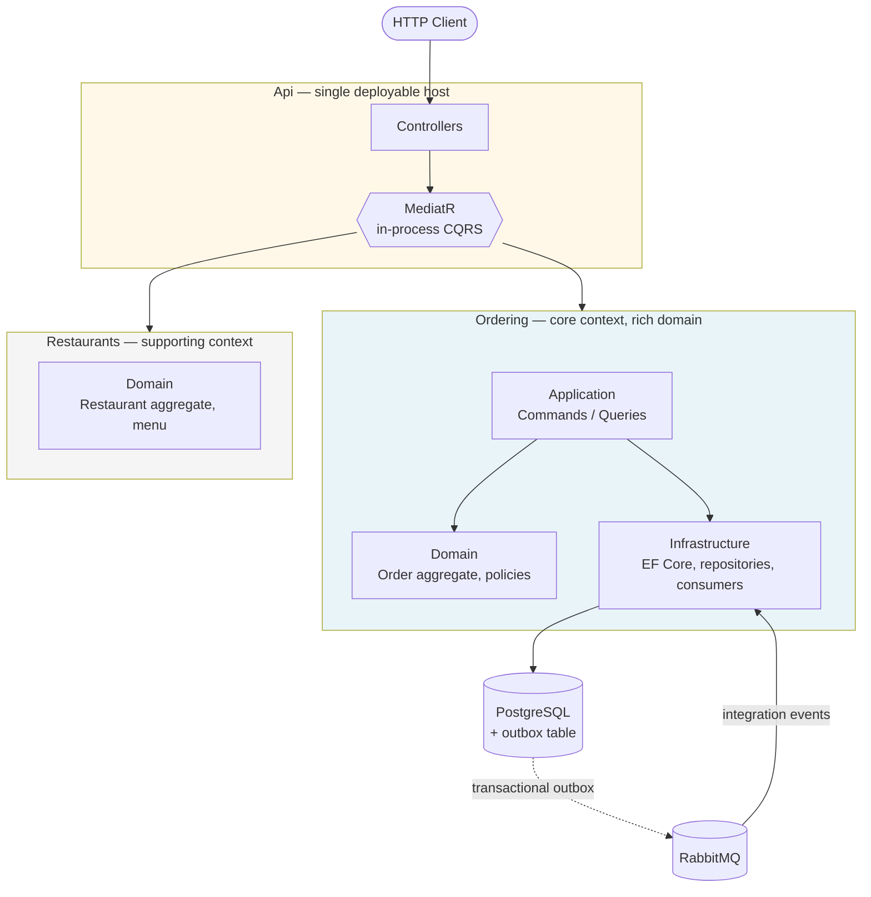

# Food Delivery

A **modular monolith** food delivery backend built on .NET 10 — exploring how far Domain-Driven Design, CQRS, and event-driven messaging can be taken *inside a single deployable unit* before microservices become worth their operational cost.

This is a portfolio project. Its purpose is not feature completeness, but demonstrating deliberate architectural decisions and the reasoning behind them.

---

## Architecture at a glance



Modules never reference each other's internals. Cross-context communication happens through **integration events** (`SharedKernel/IntegrationEvents`) over RabbitMQ, and through **explicit read adapters** — never through a shared database schema or a direct project reference into another context's domain.

---

## Bounded contexts

| Context | Role | Modelling depth | Status |
|---|---|---|---|
| **Ordering** | Core domain — the reason the system exists | Rich: aggregate, entities, value objects, typed IDs, domain events, domain policies | Implemented |
| **Restaurants** | Supporting — menu, schedule, minimum order price | Domain model only; consumed by Ordering via adapters | Domain layer implemented |
| **SharedKernel** | Cross-context building blocks and integration event contracts | `AggregateRoot`, `TypedId`, `DomainEvent`, `Result`, `Money` | Implemented |
| Payment | Supporting | Thin | Planned |
| Delivery | Supporting | Thin | Planned |

Only Ordering gets the full tactical DDD treatment. Applying it uniformly to every context is a common failure mode — it buys ceremony without buying anything else. Supporting contexts stay deliberately thin.

---

## Design decisions

### 1. Modular monolith, not microservices

Microservices would buy independent scaling and deployment. This system needs neither — but it *would* pay the full cost: distributed transactions, network failure modes, deployment orchestration, and debugging across process boundaries.

Instead, module boundaries are enforced *in code* while keeping a single process and a single database. Every cross-context call already goes through an integration event or an explicit adapter, so extracting a context into its own service later means changing transport — not rewriting the domain.

**Trade-off accepted:** the boundary is enforced by discipline and project references, not by the network. Nothing physically prevents a shortcut; a reviewer would have to catch it.

### 2. Transactional outbox for every published message

Writing to PostgreSQL and publishing to RabbitMQ are two separate systems. Doing both without coordination is the classic **dual-write problem**: the database commit succeeds, the broker publish fails, and the system is silently inconsistent.

MassTransit's EF Core outbox is wired so that outgoing messages are written to an outbox table **inside the same transaction** as the business change, then relayed to RabbitMQ afterwards:

```csharp
x.AddEntityFrameworkOutbox<OrderingDbContext>(o =>
{
    o.UsePostgres();
    o.UseBusOutbox();
});
```

Consumers additionally use `UseInMemoryOutbox`, so messages a consumer produces are only published once its own transaction commits — no phantom events from a handler that later rolled back.

**Consequence:** delivery is at-least-once, never exactly-once. Consumers must be idempotent; that is a property of the handlers, not of the broker.

### 3. Domain events published through an EF Core interceptor

Aggregates raise domain events without knowing a message bus exists. `DomainEventPublishInterceptor` — a `SaveChangesInterceptor` — collects events from tracked aggregates and publishes them as `SaveChangesAsync` runs, so publication is tied to the persistence transaction rather than scattered across handlers.

The domain layer has zero infrastructure dependencies. The bus is an implementation detail.

### 4. `Result<T, TError>` instead of exceptions for expected failures

An order below the restaurant's minimum price is not exceptional — it is an ordinary outcome the caller must handle. Exceptions are for the unexpected; expected failures are returned as values:

```csharp
public static Result<Error> CanBePlaced(Order order, Money minimalPrice)
{
    if (!OrderStatusChangePolicy.CanChangeStatusTo(order.Status, OrderStatus.Pending))
        return Result<Error>.Fail(new Error(ErrorEnum.Conflict, "Status can't be changed"));

    if (order.OrderLines.Count == 0)
        return Result<Error>.Fail(new Error(ErrorEnum.Validation, "No order lines"));

    return minimalPrice.CompareTo(order.TotalPrice) <= 0
        ? Result<Error>.Success()
        : Result<Error>.Fail(new Error(ErrorEnum.Validation, "Order price is too small"));
}
```

This keeps failure modes visible in the signature and makes control flow cheap and explicit.

### 5. Domain policies as first-class objects

Rules that span an aggregate's state and external facts (`OrderCanBePlacedPolicy`, `OrderStatusChangePolicy`) live in their own types rather than inside aggregate methods. They are pure, independently testable, and keep the aggregate readable as state transitions rather than a wall of validation.

### 6. Strongly-typed IDs

`TypedId` is an abstract record wrapping a `Guid`, rejecting `Guid.Empty` at construction. `OrderId` and `RestaurantRefId` are different types — passing one where the other is expected is a compile error, not a runtime mystery.

Because record equality includes the runtime type (`EqualityContract`), two typed IDs of different types are never equal even when they wrap the same `Guid`.

### 7. Repository and Reader split

Writes go through `IOrderRepository` (returns aggregates, enforces invariants, participates in the Unit of Work). Reads go through `IOrderReader` (returns flat DTOs, no tracking, no aggregate hydration).

CQRS is carried down to the persistence layer, not just to the mediator — a read has no reason to pay for aggregate reconstruction.

### 8. Cross-context reads via adapters

Ordering needs a restaurant's minimum order price and a menu item's price. Rather than referencing the Restaurants domain, it declares `IRestaurantMinimumOrderPriceAdapter` and `IMenuPriceForOrderLineAdapter` in its own Application layer, with stub implementations for now.

This is an anti-corruption layer: Ordering defines the contract on its own terms, and swapping the stub for a real query or a remote call is a one-class change.

---

## Reliability

| Concern | Mechanism |
|---|---|
| Dual-write inconsistency | Transactional outbox (`AddEntityFrameworkOutbox` + `UseBusOutbox`) |
| Phantom events from rolled-back handlers | `UseInMemoryOutbox` on consumers |
| Transient failures | `UseMessageRetry(r => r.Immediate(5))` |
| Persistent failures | `UseDelayedRedelivery` — 5 min → 15 min → 30 min, then the error queue |
| Startup ordering | Docker Compose health checks — the app waits for PostgreSQL and RabbitMQ |
| Schema drift | EF Core migrations applied on startup in Development |

---

## Testing

Unit tests with **xUnit**, **Moq**, and **FluentAssertions**, with coverage collected via **coverlet**.

Covered: the `Order` aggregate and `OrderLine` entity, both domain policies, every command and query handler, all message consumers, and the `Result` / `Money` building blocks.

```bash
dotnet test
```

---

## Tech stack

**.NET 10** · **C#** · ASP.NET Core · **MediatR** (in-process CQRS) · **MassTransit** + **RabbitMQ** (messaging, outbox, retry) · **Entity Framework Core** + **Npgsql** · **PostgreSQL 16** · Docker / Docker Compose · xUnit · Moq · FluentAssertions

---

## Getting started

```bash
git clone https://github.com/KeqJiil/FoodDelivery.git
cd FoodDelivery
cp .env.example .env      # fill in credentials
docker compose up --build
```

This starts the API, PostgreSQL, and RabbitMQ. Migrations are applied automatically in Development.

| Service | URL |
|---|---|
| API | http://localhost:8000 |
| OpenAPI | http://localhost:8000/openapi/v1.json |
| RabbitMQ management | http://localhost:15672 |

Running tests without Docker:

```bash
dotnet restore
dotnet test
```

---

## Project structure

```
src/
  Api/                      ASP.NET Core host — controllers, DI composition root
  Ordering/                 Core bounded context
    Domain/                 Order aggregate, OrderLine, typed IDs, domain events, policies
    Application/            One folder per use case: Command + Handler / Query + Handler
    Infrastructure/
      Persistence/          DbContext, repositories, readers, EF configurations,
                            migrations, Unit of Work, domain event interceptor
      Messaging/Consumers/  Integration event consumers
      Adapters/             Anti-corruption layer into other contexts (stubbed)
  Restaurants/              Supporting bounded context — domain model
  SharedKernel/             AggregateRoot, TypedId, DomainEvent, Result, Money,
                            integration event contracts
tests/
  UnitTest/
    Ordering/               Domain, application, and consumer tests
    SharedKernel/           Building block tests
```

---

## Roadmap

- [ ] **Payment context** — thin supporting context
- [ ] **Delivery context** — thin supporting context
- [ ] **Orchestration saga** (MassTransit state machine) coordinating order → payment → delivery, with compensating transactions for partial failure
- [ ] Replace stub adapters with real cross-context reads
- [ ] Consumer-side idempotency via an inbox table (atomic check-and-insert, status update in the same transaction as the business change)
- [ ] Structured logging (Serilog) and correlation IDs across message boundaries
- [ ] Integration tests with Testcontainers against real PostgreSQL and RabbitMQ
- [ ] CI pipeline (GitHub Actions: build, test, coverage)
