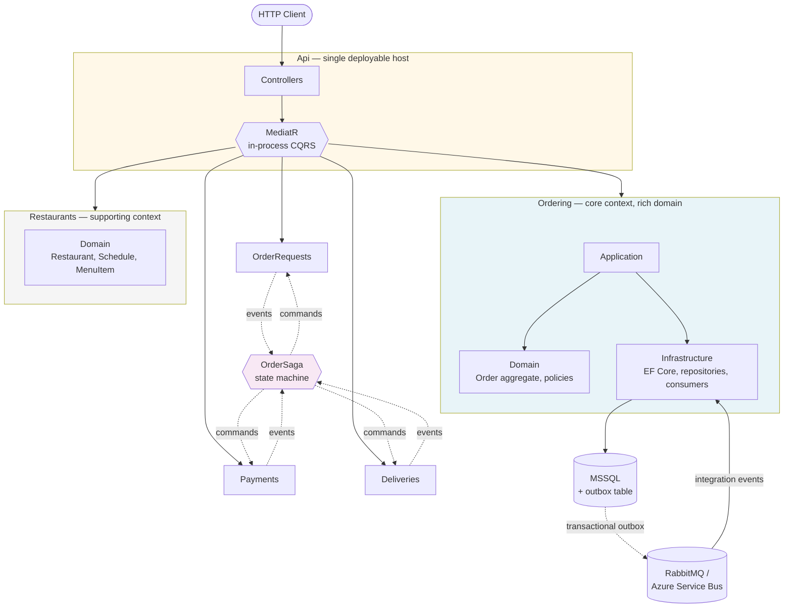
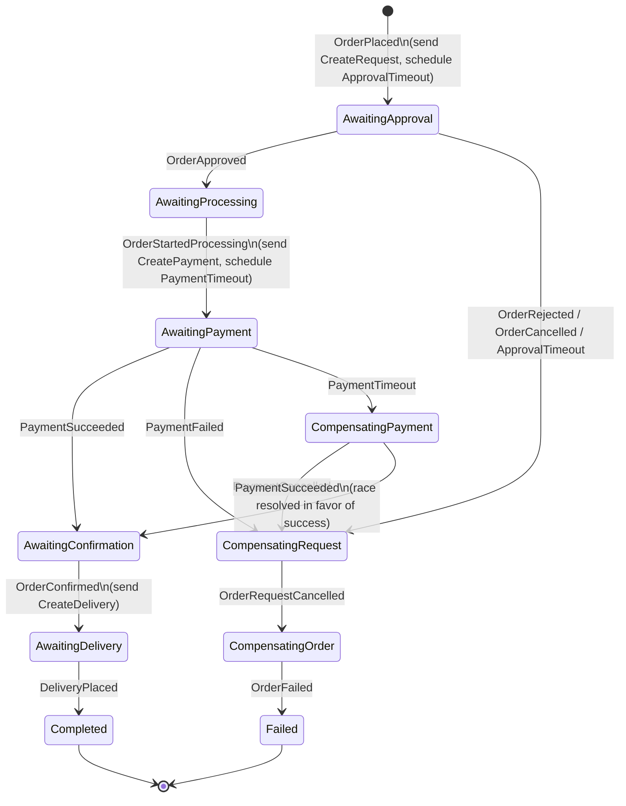

# Food Delivery

A **modular monolith** food delivery backend built on .NET 10 — exploring how far Domain-Driven Design, CQRS, saga orchestration, and event-driven messaging can be taken *inside a single deployable unit* before microservices become worth their operational cost.

This is a portfolio project. Its purpose is not feature completeness, but demonstrating deliberate architectural decisions, production-grade testing, and operational maturity (CI/CD, observability, cloud deployment) — and the reasoning behind them.

### By the numbers

| | |
|---|---|
| Bounded contexts | 6 (Ordering, Restaurants, OrderRequests, Payments, Deliveries, Saga) |
| Unit tests | 350+ across 8 per-module projects |
| Integration tests | 167, against real MSSQL + RabbitMQ via Testcontainers |
| Production bugs caught *by the test suite itself* | 11 — see [Testing](#testing) |
| CI | build + full test suite (Docker-backed) on every PR |
| CD | auto-deploy to Azure Container Apps on merge to `main` |

The 11-bugs number is the point, not a vanity metric: every one of them is a case where the code built cleanly, looked correct on review, and would have shipped a real defect — wrong data on the wire, a silently dropped event, a request that 500s under real SQL Server, a redelivered message that faults instead of no-oping. Details below.

---

## Architecture at a glance


```mermaid
flowchart TB
    Client([HTTP Client]) --> Api

    subgraph Host["Api — single deployable host"]
        Api[Controllers] --> MediatR{{MediatR<br/>in-process CQRS}}
    end

    MediatR --> Ordering
    MediatR --> Restaurants
    MediatR --> OrderRequests
    MediatR --> Payments
    MediatR --> Deliveries

    OrderRequests -.->|events| Saga{{OrderSaga<br/>state machine}}
    Payments -.->|events| Saga
    Deliveries -.->|events| Saga
    Saga -.->|commands| OrderRequests
    Saga -.->|commands| Payments
    Saga -.->|commands| Deliveries

    subgraph Ordering["Ordering — core context, rich domain"]
        OApp[Application] --> ODom[Domain<br/>Order aggregate, policies]
        OApp --> OInf[Infrastructure<br/>EF Core, repositories, consumers]
    end

    subgraph Restaurants["Restaurants — supporting context"]
        RDom[Domain<br/>Restaurant, Schedule, MenuItem]
    end

    OInf --> DB[(MSSQL<br/>+ outbox table)]
    DB -.->|transactional outbox| MQ[(RabbitMQ /<br/>Azure Service Bus)]
    MQ -->|integration events| OInf

    style Ordering fill:#e8f4f8
    style Restaurants fill:#f5f5f5
    style Saga fill:#f8e8f4
    style Host fill:#fff8e8
```

Modules never reference each other's internals. Cross-context communication happens through **integration events** (`SharedKernel/IntegrationEvents`) routed through MassTransit, and through **explicit read adapters** — never through a shared database schema or a direct project reference into another context's domain. `OrderSaga` (a MassTransit state machine) coordinates the multi-step order → approval → payment → delivery flow, including compensation on rejection, timeout, or payment failure.

---

## Bounded contexts

| Context | Role | Modelling depth | Status |
|---|---|---|---|
| **Ordering** | Core domain — the reason the system exists | Rich: aggregate, entities, value objects, typed IDs, domain events, domain policies | Implemented |
| **Restaurants** | Supporting — menu, schedule, minimum order price | Domain model, owned types (`Schedule`, `OpeningWindows`, `MenuItem`) | Implemented |
| **OrderRequests** | Supporting — restaurant-side approval workflow, cursor-paginated listing | Domain model + application handlers | Implemented |
| **Payments** | Supporting — charge, succeed/fail, cancel | Domain model + mock payment gateway adapter | Implemented |
| **Deliveries** | Supporting — status lifecycle (Pending → PickedUp → Delivered) | Domain model + application handlers | Implemented |
| **Saga** | Orchestration — coordinates the above via a MassTransit state machine | `OrderSaga` with approval/payment timeouts and compensating transactions | Implemented |
| **SharedKernel** | Cross-context building blocks and integration event contracts | `AggregateRoot`, `TypedId`, `DomainEvent`, `Result`, `Money`, correlation-id filters | Implemented |

Only Ordering gets the full tactical DDD treatment. Applying it uniformly to every context is a common failure mode — it buys ceremony without buying anything else. Supporting contexts stay deliberately thin, each with its own EF Core `DbContext` and schema (`ordering`, `restaurants`, `order_requests`, `payments`, `deliveries`, `saga`), unified behind `src/Api`.

---

## Design decisions

### 1. Modular monolith, not microservices

Microservices would buy independent scaling and deployment. This system needs neither — but it *would* pay the full cost: distributed transactions, network failure modes, deployment orchestration, and debugging across process boundaries.

Instead, module boundaries are enforced *in code* while keeping a single process and a single database. Every cross-context call already goes through an integration event or an explicit adapter, so extracting a context into its own service later means changing transport — not rewriting the domain.

**Trade-off accepted:** the boundary is enforced by discipline and project references, not by the network. Nothing physically prevents a shortcut; a reviewer would have to catch it.

### 2. Transactional outbox for every published message

Writing to the database and publishing to the message broker are two separate systems. Doing both without coordination is the classic **dual-write problem**: the database commit succeeds, the broker publish fails, and the system is silently inconsistent.

MassTransit's EF Core outbox is wired so that outgoing messages are written to an outbox table **inside the same transaction** as the business change, then relayed by a background delivery service afterwards:

```csharp
x.AddEntityFrameworkOutbox<OrderingDbContext>(o =>
{
    o.UseSqlServer();
    o.QueryDelay = TimeSpan.FromMilliseconds(configuration.GetValue("Messaging:OutboxQueryDelayMs", 10000));
});
```

`UseBusOutbox()` (a bus-wide middleware that captures *any* `Send`/`Publish` call app-wide into the outbox) was deliberately left out: `DomainEventPublishInterceptor` is the only place the codebase ever calls `Publish`, and it always does so during that same `OrderingDbContext`'s `SaveChangesAsync` — the exact scope `AddEntityFrameworkOutbox<OrderingDbContext>` already covers on its own. The bus-wide catch-all has nothing extra to catch here.

Consumers additionally use `UseInMemoryOutbox`, so messages a consumer produces are only published once its own transaction commits — no phantom events from a handler that later rolled back.

**Consequence:** delivery is at-least-once, never exactly-once. Consumers must be idempotent; that is a property of the handlers, not of the broker. Idempotency (redelivery-safe consumers, unique-constraint-backed conflict handling) is covered explicitly in the integration test suite.

### 3. Saga orchestration for the cross-module order flow

Placing an order touches four contexts in sequence: `OrderRequests` (restaurant approval) → `Payments` (charge) → `Deliveries` (dispatch), with `Ordering` as the originating aggregate. `OrderSaga` — a MassTransit state machine — owns this coordination instead of scattering it across handlers: it reacts to domain events translated onto the bus, sends commands to the next context, and drives compensating transactions when a step is rejected, times out, or fails.

Timeouts (`TimeoutApprovement`, `TimeoutPayment`) are configurable via `IOptions<SagaOptions>` rather than hardcoded, and the saga's own state is persisted with EF Core under optimistic concurrency (`row_version`), so it survives process restarts and is safe under concurrent updates.


```mermaid
stateDiagram-v2
    [*] --> AwaitingApproval: OrderPlaced\n(send CreateRequest, schedule ApprovalTimeout)
    AwaitingApproval --> AwaitingProcessing: OrderApproved
    AwaitingApproval --> CompensatingRequest: OrderRejected / OrderCancelled / ApprovalTimeout
    AwaitingProcessing --> AwaitingPayment: OrderStartedProcessing\n(send CreatePayment, schedule PaymentTimeout)
    AwaitingPayment --> AwaitingConfirmation: PaymentSucceeded
    AwaitingPayment --> CompensatingRequest: PaymentFailed
    AwaitingPayment --> CompensatingPayment: PaymentTimeout
    AwaitingConfirmation --> AwaitingDelivery: OrderConfirmed\n(send CreateDelivery)
    AwaitingDelivery --> Completed: DeliveryPlaced
    CompensatingPayment --> CompensatingRequest: PaymentCancelled
    CompensatingPayment --> AwaitingConfirmation: PaymentSucceeded\n(race resolved in favor of success)
    CompensatingRequest --> CompensatingOrder: OrderRequestCancelled
    CompensatingOrder --> Failed: OrderFailed
    Completed --> [*]
    Failed --> [*]
```

Every terminal-looking transition (`Rejected`, `Cancelled`, timeout) routes through a dedicated `Compensating*` state rather than failing in place — the saga always unwinds through the same explicit chain (cancel the payment if one was taken, cancel the order request, fail the order) regardless of which step triggered it.

### 4. Domain events published through an EF Core interceptor

Aggregates raise domain events without knowing a message bus exists. `DomainEventPublishInterceptor` — a `SaveChangesInterceptor` — collects events from tracked aggregates and publishes them as `SaveChangesAsync` runs, so publication is tied to the persistence transaction rather than scattered across handlers.

The domain layer has zero infrastructure dependencies. The bus is an implementation detail.

### 5. `Result<T, TError>` instead of exceptions for expected failures

An order below the restaurant's minimum price is not exceptional — it is an ordinary outcome the caller must handle. Exceptions are for the unexpected; expected failures are returned as values:

```csharp
public static Result<Error> CanBePlaced(Order order, Money minimalPrice)
{
    if (!OrderStatusChangePolicy.CanChangeStatusTo(order.Status, OrderStatus.Pending))
        return Result<Error>.Fail(new Error(ErrorEnum.Conflict, "Status can't be changed"));

    if (order.OrderLines.Count == 0)
        return Result<Error>.Fail(new Error(ErrorEnum.Validation, "No order lines"));

    return minimalPrice.CompareTo(order.TotalPrice) <= 0
        ? Result<Error>.Success()
        : Result<Error>.Fail(new Error(ErrorEnum.Validation, "Order price is too small"));
}
```

This keeps failure modes visible in the signature and makes control flow cheap and explicit.

### 6. Domain policies as first-class objects

Rules that span an aggregate's state and external facts (`OrderCanBePlacedPolicy`, `OrderStatusChangePolicy`) live in their own types rather than inside aggregate methods. They are pure, independently testable, and keep the aggregate readable as state transitions rather than a wall of validation.

### 7. Strongly-typed IDs

`TypedId` is an abstract record wrapping a `Guid`, rejecting `Guid.Empty` at construction. `OrderId` and `RestaurantRefId` are different types — passing one where the other is expected is a compile error, not a runtime mystery.

Because record equality includes the runtime type (`EqualityContract`), two typed IDs of different types are never equal even when they wrap the same `Guid`. Some typed IDs additionally implement `IComparable<T>` (e.g. `OrderRequestId`, `Money`) so cursor-based pagination can compare them server-side without breaking EF Core's SQL translation.

### 8. Repository and Reader split

Writes go through repository interfaces (return aggregates, enforce invariants, participate in the Unit of Work). Reads go through reader interfaces (return flat DTOs, no tracking, no aggregate hydration).

CQRS is carried down to the persistence layer, not just to the mediator — a read has no reason to pay for aggregate reconstruction.

### 9. Cross-context reads via adapters

Ordering needs a restaurant's minimum order price and a menu item's price. Rather than referencing the Restaurants domain, it declares its own adapter interfaces in its Application layer, implemented against Restaurants' reader.

This is an anti-corruption layer: Ordering defines the contract on its own terms, and swapping the implementation for a different source is a one-class change.

### 10. Correlation via `AsyncLocal`, propagation via OpenTelemetry

Correlating a single logical request across an HTTP call and multiple async message hops (saga → command → consumer) can't rely on DI scope — ASP.NET Core's request scope and MassTransit's per-message consume scope are different scopes even within the same logical flow. `CorrelationContext` uses `AsyncLocal<string?>`, which flows with the async call chain regardless of scope boundaries; middleware and MassTransit send/publish/consume filters read and write it consistently.

OpenTelemetry tracing (`AddSource("MassTransit")`) additionally propagates W3C trace context through message headers natively, giving a single `TraceId` across HTTP → saga → every downstream consumer for free — verified empirically by capturing real trace output across multiple hops.

---

## Reliability

| Concern | Mechanism |
|---|---|
| Dual-write inconsistency | Transactional outbox (`AddEntityFrameworkOutbox<OrderingDbContext>`, written from the same `SaveChangesAsync` that persists the business change) |
| Phantom events from rolled-back handlers | `UseInMemoryOutbox` on consumers |
| Transient failures | `UseMessageRetry(r => r.Immediate(5))` |
| Persistent failures | `UseDelayedRedelivery` — 5 min → 15 min → 30 min, then the error queue |
| Duplicate/redelivered messages | Idempotent consumers; DB-level unique constraints mapped to `Error.Conflict` instead of an unhandled exception |
| Concurrent updates | Optimistic concurrency (`row_version`) on every table, including saga state |
| Startup ordering | Docker Compose health checks — the app waits for MSSQL and RabbitMQ |
| Schema drift | EF Core migrations applied automatically on startup |

---

## Observability

- **OpenTelemetry** traces and metrics, instrumented via `AddAspNetCoreInstrumentation` and MassTransit's native `ActivitySource`.
- **Jaeger** (local dev, via Docker Compose) for trace visualization — no extra code needed beyond the OTLP exporter.
- **Azure Monitor** exporter wired conditionally (only enabled when `APPLICATIONINSIGHTS_CONNECTION_STRING` is set), so the same OTel pipeline feeds Application Insights in production without a separate instrumentation path.
- **Correlation IDs** threaded through HTTP requests and message headers (see design decision 10), independent of the trace ID, for a human/business-facing identifier alongside the technical one.

---

## Testing

Two-tier suite:

- **Unit tests** (`tests/UnitTest`) — xUnit, Moq, FluentAssertions, coverage via coverlet. One project per module (Ordering, Restaurants, OrderRequests, Payments, Deliveries, Saga, Api, SharedKernel). Covers aggregates, domain policies, command/query handlers, message consumers, and shared building blocks.
- **Integration tests** (`tests/IntegrationTest`) — real MSSQL and RabbitMQ via **Testcontainers**, fast per-test resets via **Respawn**, HTTP-level tests via `WebApplicationFactory<Program>`, and message-level assertions via MassTransit's `ITestHarness`. Covers persistence (round-trips, concurrency, EF query translation), messaging (translators, wire-contract serialization, outbox, retry, idempotency), the saga state machine, HTTP endpoints, and full end-to-end order flows (happy path, rejection, timeout, payment failure).

The integration suite has caught real bugs that unit tests structurally cannot, because they only exist at the boundary with real infrastructure. A sample:

| # | Bug | Why unit tests couldn't have caught it |
|---|---|---|
| 1 | `Where(x => x.Id.Id == id)` on a typed-id-converted column doesn't translate to SQL — `InvalidOperationException` on every call. Recurred 3× across `PaymentReader`, `DeliveryReader`, `OrderRequestReader` (same copy-pasted pattern) | Only EF Core's real SQL provider rejects this; an in-memory provider or a mocked repository would happily return the wrong (or right-by-accident) result |
| 2 | `OrderRejected` had **no translator at all**, and the domain event itself was missing the field (`OrderRefId`) a correct translator would need — rejecting an order left `OrderSaga` stuck until a timeout instead of compensating immediately | Found while writing a saga correlation test that needed to drive this exact branch; nothing else exercised it |
| 3 | `UseBusOutbox` redelivery silently no-oped when a message type had no subscriber (`DestinationAddress` resolves to `null`, batch still marked "delivered") | Only visible against MassTransit's real EF outbox delivery service — root-caused by decompiling `MassTransit.EntityFrameworkCoreIntegration.dll` with `ilspycmd` after the in-memory harness gave no signal |
| 4 | Registering correlation-id filters inside the per-receive-endpoint callback caused `ObjectDisposedException` on outbox-deferred sends, silently dropping downstream messages | Only reproduces under a real broker + real outbox + real retry combination running together — e2e tests using a bare harness stayed green throughout |

Cursor pagination (`OrderRequestReader.GetAllByRestaurantIdAsync`) got the same scrutiny: rather than trust a green test, the generated SQL was captured directly (`.LogTo` + `EnableSensitiveDataLogging`) to confirm the cursor filter and `TOP` limit were genuinely pushed server-side and not silently pulling the table into memory — a real EF Core failure mode pre-3.0, and worth verifying rather than assuming the framework still guards against it.

```bash
dotnet test                                              # everything
dotnet test tests/UnitTest                                # unit only, no Docker needed
dotnet test tests/IntegrationTest/IntegrationTest.csproj  # integration, needs Docker Desktop running
```

---

## CI/CD

- **CI** (`.github/workflows/ci.yml`) — runs on every push/PR to `main`: restore, build, `dotnet test` (unit + integration, Docker-backed).
- **CD** (`.github/workflows/cd.yml`) — on push to `main`: builds the API's Docker image, pushes it to Azure Container Registry, and deploys to an Azure Container App via `az containerapp update`.

---

## Tech stack

**.NET 10** · **C#** · ASP.NET Core · **MediatR** (in-process CQRS) · **MassTransit** (messaging, saga orchestration, outbox, retry) · **RabbitMQ** (local/dev transport) · **Azure Service Bus** (production transport) · **Entity Framework Core** · **MSSQL** · **OpenTelemetry** (traces + metrics) · **Jaeger** (local trace UI) · **Azure Monitor** (production observability) · **Serilog** · Docker / Docker Compose · **Azure Container Apps** + **Azure Container Registry** · GitHub Actions · xUnit · Moq · FluentAssertions · **Testcontainers** · **Respawn**

---

## Getting started

```bash
git clone https://github.com/KeqJiil/FoodDelivery.git
cd FoodDelivery
cp .env.example .env      # fill in credentials
docker compose up --build
```

This starts the API, MSSQL, RabbitMQ, and Jaeger. Migrations are applied automatically on startup.

| Service | URL |
|---|---|
| API | http://localhost:8000 |
| OpenAPI | http://localhost:8000/openapi/v1.json |
| RabbitMQ management | http://localhost:15672 |
| Jaeger UI | http://localhost:16686 |

Running tests without Docker (unit tests only — integration tests need Docker Desktop for Testcontainers):

```bash
dotnet restore
dotnet test tests/UnitTest
```

---

## Project structure

```
src/
  Api/                      ASP.NET Core host — controllers, DI composition root, OpenTelemetry setup
  Ordering/                 Core bounded context
    Domain/                 Order aggregate, OrderLine, typed IDs, domain events, policies
    Application/            One folder per use case: Command + Handler / Query + Handler
    Infrastructure/
      Persistence/          DbContext, repositories, readers, EF configurations,
                             migrations, Unit of Work, domain event interceptor
      Messaging/Consumers/  Integration event consumers
      Adapters/             Anti-corruption layer into other contexts
  Restaurants/               Supporting context — menu, schedule, minimum order price
  OrderRequests/             Supporting context — restaurant approval workflow, cursor pagination
  Payments/                  Supporting context — charge, succeed/fail, cancel
  Deliveries/                Supporting context — delivery status lifecycle
  Saga/                      OrderSaga state machine — orchestration and compensation
  SharedKernel/               AggregateRoot, TypedId, DomainEvent, Result, Money,
                              integration event contracts, correlation-id filters
tests/
  UnitTest/                  One project per module — domain, application, consumer tests
  IntegrationTest/
    Infrastructure/          Testcontainers fixtures, Respawn reset, WebApplicationFactory
    Persistence/              Round-trip, concurrency, and query-translation tests per module
    Messaging/                 Translators, wire-contract, outbox, retry, idempotency tests
    Saga/                      Persistence, correlation, concurrency, timeout tests
    Api/                       HTTP endpoint tests per module
    EndToEnd/                  Full saga flow scenarios (happy path, rejection, timeout, payment failure)
```

---

## Roadmap

- [ ] Application Insights in production (Azure Monitor exporter is wired; Azure resource provisioning and Key Vault/secrets strategy not yet done)
- [ ] Decide whether the hand-rolled correlation ID is still worth keeping now that OpenTelemetry's `TraceId` propagates end-to-end natively
- [ ] Multi-instance-safe startup migrations (current `MigrateAsync()` on startup is safe for a single instance; concurrent migration attempts from multiple simultaneously-starting replicas isn't handled — not relevant at current single-instance scale)
- [ ] Audit remaining handlers for the unconditional-insert-without-unique-index gap found and fixed in `Deliveries`
- [ ] Dedicated read models, built off the same integration events already flowing through the outbox, instead of readers querying each module's write-side schema directly — a natural extension of the CQRS split that's already in place, accepting eventual consistency on the read side in exchange for read models shaped for actual query needs (e.g. a cross-module order summary) rather than joins across module boundaries
